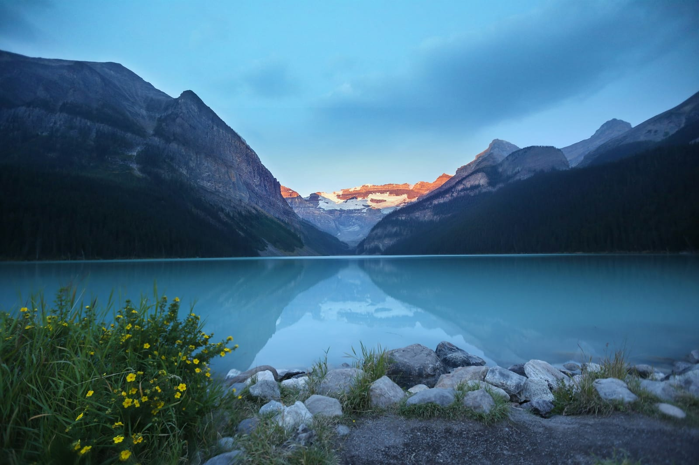

## Paths

An image in a post is a markdown image: the alt text in the brackets, the path in the parentheses, and an optional title in quotes after the path that carries the layout keyword and the caption. The site serves `public/images/writing/` at `/images/writing/`, and both ways of writing the path work:

```md


```

The second form is repo-relative, which is what Obsidian needs to preview the image while you write. The renderer normalizes it back to the site path. The examples here use the short form so they are easier to read.

## Alt text

Alt text describes the image for someone who cannot see it. Say what is in the frame, not what it means to the post; the surrounding prose already does that. A screenshot of a settings screen is "The Ridge settings screen with sync turned off", not "Settings". If an image is purely decorative, an empty alt (``) is honest. `node scripts/generate-alt-text.mjs` writes a draft for every image that lacks one.

## Layouts

With no keyword, an image sits centered in the media column, which is wider than the text. Add a caption by writing it as the title:


`full` bleeds the image edge to edge:


`portrait` narrows the column so a tall image does not tower over the text:


`narrow` is a middle width for images that are more diagram than photograph, and a bare number sets an exact maximum width in pixels:


Two flags share the keyword slot. `border` draws a hairline around an image whose edges match the page (a white screenshot on a white page), and `shadow` gives a window screenshot the floating-window treatment:


Every image opens in a lightbox on click, and the lightbox gallery is the post's images in order. There is nothing to configure.

## Image rows

Three portrait images side by side are an `ImageRow`. It takes an array of images with `src` and `alt`, and lays them out as equal columns:

<ImageRow images={[
  { src: "/images/writing/example-row-1.jpg", alt: "A red tram at a rain-soaked stop at night, Toronto" },
  { src: "/images/writing/example-row-2.jpg", alt: "Angled concrete columns of a modern building, Seoul" },
  { src: "/images/writing/example-row-3.jpg", alt: "Sunlight through a window casting its frame on a wall, Melbourne" }
]} />

Rows work best with images of the same aspect ratio. Mixed ratios line up at the top and leave ragged bottoms.

## Captioned photographs

`PhotoCaption` is the explicit form of a captioned image: the same layout keywords as the markdown title, passed as props. Use it when the caption is too long for a title string.

<PhotoCaption
  src="/images/writing/example-lead.jpg"
  alt="A calm mountain lake reflecting snowy peaks at dawn"
  width={1600}
  height={1067}
  variant="narrow"
  caption="PhotoCaption takes width and height, so pass the file's real pixel dimensions. Lake Louise, by Roberto Nickson on Unsplash"
/>

## Before and after

A `BlinkComparator` puts two images in one slot and swaps them on hover or tap, with no crossfade. The eye holds still while the pixels change, so small differences jump out. Pass both alts and the shared dimensions.

<BlinkComparator
  a="/images/writing/example-before.jpg"
  b="/images/writing/example-after.jpg"
  altA="Window light on a wall, as shot"
  altB="The same frame graded warmer and brighter"
  width={1600}
  height={1000}
  caption="Hover or tap to flip between the frame as shot and the graded version. Melbourne, by Alexander Possingham on Unsplash"
/>

## Phone stills

A phone screenshot baked into a device frame is a plain markdown image whose file name ends in `-framed.png`. The renderer recognizes the suffix and gives it the portrait phone treatment, so Obsidian previews it like any other image:


`BezelImage` is the explicit tag for the same thing, for when the file is named differently or you want to pass dimensions:

<BezelImage src="/images/writing/example-phone-framed.png" alt="A phone frame around a photograph of angled concrete columns" width={900} height={1840} />

## Video

Video in a post is silent, autoplays when it scrolls into view, pauses when it leaves, and never shows native controls, with one exception below. Each clip is an `.mp4` in `public/images/writing/` with a `.jpg` poster beside it. The build checks for the poster, and it is where the clip's aspect ratio comes from, so the page reserves the right box before any video data arrives.

`Video` is the standard tag. `src` points at the clip and `poster` at its first frame. Add `alt` for the accessible name and `loop` for a clip that should run continuously. The thin bar under the clip is the progress bar; pass `noProgress` to hide it on short decorative loops.

<Video src="/images/writing/example-clip.mp4" poster="/images/writing/example-clip.jpg" alt="The Platinum mark, rendered in three dimensions, swaying slowly" loop />

`PortraitVideo` narrows the column for a phone recording and rounds the loading shimmer to a phone silhouette:

<PortraitVideo src="/images/writing/example-clip-portrait.mp4" poster="/images/writing/example-clip-portrait.jpg" loop />

`GifVideo` is for the clip that would once have been an animated gif: a short loop, a preferred `.webm` beside the `.mp4` when you have one, and a caption as the tag's children.

<GifVideo src="/images/writing/example-loop.mp4" alt="The Platinum mark in three dimensions, a two-second sway" noProgress>A caption under a gif-style loop, written as the tag's children</GifVideo>

`VideoEmbed` is the one tag that renders native controls, for a clip with sound. It takes an explicit `poster`, its `width` and `height` for the aspect ratio, and an optional `captions` WebVTT file:

<VideoEmbed
  src="/images/writing/example-clip.mp4"
  poster="/images/writing/example-clip.jpg"
  width={1280}
  height={720}
  captions="/images/writing/example-clip.vtt"
  caption="A clip with native controls and a captions track"
/>

Two more tags exist for phone recordings, `PhoneVideoClassic` and `PhoneVideoModern`, which draw a device frame around a portrait clip; `docs/example-content.md` lists every tag with its props.

## The lead image

Social cards and the feed use the post's lead image. It is the `image` field in the frontmatter when there is one (this post sets it to the lake above), and otherwise the first markdown image in the body. Posts with neither get a generated text card with the title and date.
